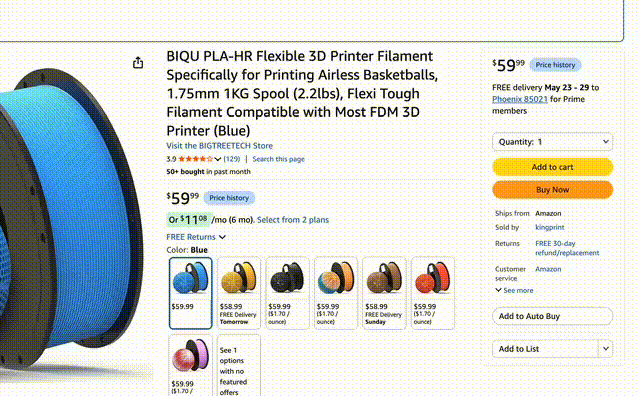

# Amazon Wishlist Search

A userscript that adds a search box to Amazon's **Add to List** wishlist popover,
so you can filter long wishlist menus by typing. Clicking a list adds the item
in place — the popover stays open, so you can add to several lists in one go —
and it optionally keeps a "Previously selected" group of your most-used lists at
the top.



This is the TypeScript source. Builds compile `src/` into a single
`*.user.js` file that Tampermonkey / Violentmonkey / Greasemonkey installs.

## Install (users)

Install a userscript manager (Tampermonkey, Violentmonkey, or Greasemonkey),
then open:

https://github.com/jhyland87/userscript-amazon-wishlist-search/releases/latest/download/amazon-wishlist-search.user.js

The manager will offer to install it. After that it **auto-updates**: the
script's `@updateURL`/`@downloadURL` point at that always-latest release link,
so your manager picks up new releases automatically. The raw `main` branch is
for development and may contain unreleased changes.

## Requirements

- Node.js 18+ (built/tested on Node 22)
- [pnpm](https://pnpm.io/) (pinned via the `packageManager` field — run
  `corepack enable` and pnpm will use the right version automatically)
- A userscript manager (Tampermonkey, Violentmonkey, or Greasemonkey)

## Setup

```bash
pnpm install
```

## Build

```bash
pnpm build
```

This typechecks (`tsc --noEmit`) and then bundles with
[vite-plugin-monkey](https://github.com/lisonge/vite-plugin-monkey), emitting:

```
dist/amazon-wishlist-search.user.js
```

For local testing, point your userscript manager at that file (drag it in, or
open it directly). The userscript metadata block (`@name`, `@include`,
`@grant`, …) is generated from the `userscript` section of
[`vite.config.ts`](./vite.config.ts) — edit it there, not by hand.

## Develop

```bash
pnpm dev
```

Starts Vite's dev server. vite-plugin-monkey serves an auto-installing
development userscript with hot-reload, so saving a `.ts` file updates the
running script in the browser. Use `pnpm typecheck` to typecheck without
building.

The dev server runs over **HTTPS** (via `vite-plugin-mkcert`). This is required
because HTTPS sites like Amazon block the injected dev script as mixed content
if it's served over HTTP. mkcert installs a locally-trusted CA on first run
(it may prompt for your password once), so the dev entry loads with no
certificate warning. Production builds are unaffected — mkcert only applies to
`pnpm dev`.

If `pnpm dev` still shows nothing on the page, you're likely looking at the
dev *loader* failing to reach the server. The reliable path is always to
`pnpm build` and install `dist/amazon-wishlist-search.user.js` directly — that
file is fully self-contained (no dev server) and behaves like any normal
userscript.

## Test

```bash
pnpm test
```

Uses [Vitest](https://vitest.dev/). `pnpm test` builds first (via the `pretest`
hook), then runs the suite in [`test/`](./test):

- `wishlist-api.test.ts` — the wire protocol: request bodies built byte-for-byte
  against captured requests, and every response case (success, signed out, token
  rejected, HTTP error, unrecognized) classified from real recorded bodies in
  `test/fixtures/`. Includes a guard that classification keys off element IDs
  rather than English copy, since the script runs on every Amazon TLD.
- `wishlist-client.test.ts` — that requests go to origin-relative paths (never a
  hardcoded `amazon.com`), carry the right headers, rotate the CSRF token from
  each response, retry a rejected token exactly once, and run one at a time.
- `metadata.test.ts` — asserts on the built `dist/*.user.js`: that `@version`
  matches `package.json`, that `@updateURL`/`@downloadURL` point at the latest
  release asset (and not the raw `main` branch), `@grant none`, and the
  `@include` rules. This guards the auto-update wiring.
- `release.test.ts` — a release-integrity check (mirrors
  [unwall](https://github.com/kelesmert/unwall)): downloads the asset from the
  latest GitHub release, hashes it, and asserts the release notes publish that
  SHA-256. It is **skipped** unless run via `pnpm test:release`
  (`CHECK_GITHUB_RELEASE=1`).

## Release & auto-update

Auto-update works through GitHub Releases: managers poll the `@updateURL`
permalink and update when `@version` increases. The userscript version comes
from `package.json` (vite-plugin-monkey reads it there), so there's a single
source of truth. To cut a release:

1. Bump the version and create the tag in one step:

   ```bash
   pnpm version patch   # or minor / major — updates package.json and tags vX.Y.Z
   git push --follow-tags
   ```

2. The [`release` workflow](./.github/workflows/release.yml) runs on the tag:
   it builds, runs tests, verifies the tag matches `@version`, computes the
   asset's SHA-256, and publishes a GitHub Release with
   `amazon-wishlist-search.user.js` attached and the checksum in the notes.

Because the asset is attached at the stable
`releases/latest/download/amazon-wishlist-search.user.js` URL, every installed
user is updated automatically. `dist/` is not committed — releases are built by
CI.

## Project structure

```
src/
  main.ts             Entry point — wires everything up
  config.ts           CONFIG values, DOM SELECTORS, endpoint paths
  dom.ts              Live-popover DOM helpers
  regex.ts            Regex parsing / escaping / compiling helpers
  regex-state.ts      Runtime on/off toggle for regex search (persisted)
  frequencies.ts      localStorage selection-frequency + blocklist tracking
  frequent-section.ts "Previously selected" group + its inline controls
  frequent-state.ts   Runtime on/off toggle for the group (persisted)
  add-interceptor.ts  Captures row clicks so items are added in place
  wishlist-api.ts     Request bodies and response classification (no DOM)
  wishlist-client.ts  fetch, request queue, CSRF token rotation, timeouts
  page-params.ts      Reads ASIN / token / session values off the product page
  row-status.ts       The per-row ✓ / ⚠ / spinner badge
  multi-add-state.ts  Runtime on/off toggle for adding in place (persisted)
  icons.ts            Inline SVG icons for the injected UI
  result-count.ts     "N results" notice element
  search.ts           Search + debounce + highlight logic
  styles.ts           Injected stylesheet for the input
  inject.ts           Builds and inserts the search UI (input + regex toggle)
  observer.ts         MutationObserver + ESC handling
  log.ts              Prefixed console logger
  types/index.ts      Shared interfaces and types
test/
  wishlist-api.test.ts    Request bodies + response classification
  wishlist-client.test.ts fetch wiring, token rotation, retry, queueing
  *-state.test.ts         Persisted feature toggles
  regex.test.ts           Pattern parsing
  frequencies.test.ts     Selection-frequency bookkeeping
  metadata.test.ts        Asserts built userscript metadata / auto-update wiring
  release.test.ts         Release SHA-256 integrity check (opt-in)
  fixtures/               Real Amazon responses, recorded verbatim
.github/workflows/    CI (test) and release automation
```

## Configuration

Behaviour is controlled by `CONFIG` in [`src/config.ts`](./src/config.ts):
debounce delay, max results shown, regex mode, and the frequent-lists group.
Every persisted value's `localStorage` key lives in `STORAGE_KEYS` in the same
file. When the frequent-lists group is enabled, a `window.clearWishlistHistory()`
helper is exposed in the console to reset it.

### Adding to several lists at once

Normally, picking a list hands you off to Amazon: a confirmation modal opens and
the popover closes, so adding one item to three lists means opening the popover
three times. Instead, the click is intercepted and the item is added directly:

- The row shows a spinner, then a green **✓** — and the popover stays open, so
  you can immediately pick another list.
- Hover a ✓ to turn it into an **↩**; clicking that takes the item back off that
  list. (The undo needs a line-item ID from the page. If the page doesn't expose
  one, the ✓ stays put with no undo arrow rather than offering a button that
  would fail — `wishlistSearchDebug()` reports this as `itemIdFound: false`.)
- If a request fails, the row shows a **⚠** instead. Clicking it hands the add
  back to Amazon's own flow, so there's always a way through. Hover it for the
  reason.
- Only confirmed adds count toward the "Previously selected" group, and an undo
  takes the count back off.

If Amazon ever changes the endpoint, turn the whole thing off and you get the
stock behaviour back:

```js
wishlistSearchMultiAdd(false)  // back to Amazon's confirmation modal
wishlistSearchMultiAdd(true)   // add in place (default)
wishlistSearchMultiAdd()       // return the current state, unchanged
```

The setting persists across refreshes and takes effect on the next click — no
need to reopen the popover.

### Managing the "Previously selected" group

The group starts **collapsed** — just the label with a **▸** caret — so a long
list of remembered wishlists can't push the search box out of view. Click the
label to expand it; that lasts until you close the popover, and the next open
starts collapsed again. Typing in the search box expands the group automatically
for as long as the search is running, so matches inside it are never hidden from
you. `CONFIG.collapseFrequentLists` sets the state every open starts from.

The group can be managed inline — the controls stay hidden until you hover:

- Hover a row → an **✕** removes just that list from the group; a **trash** icon
  also blocks it from ever reappearing there.
- Hover the **Previously selected** label → an **✕** clears the whole group; a
  **toggle** turns the feature off. While off, the label stays (struck through,
  italic) with just the toggle — click it (or run `wishlistSearchFrequent(true)`)
  to turn it back on.

```js
wishlistSearchFrequent(true)   // enable the group (persists across refreshes)
wishlistSearchFrequent(false)  // disable it
wishlistSearchFrequent()       // return the current state, unchanged
```

### Regex search

A small icon inside the right edge of the search box toggles regex mode
(persists across refreshes):

- **`Txt`** (default) — your text is matched literally (case-insensitive).
- **`(.*)`** — your text is treated as a regular expression; a `/pattern/flags`
  form is honoured too, and an incomplete pattern falls back to a literal match
  while you type.

`CONFIG.regexSearches` sets the default mode.

### Debug logging

`CONFIG.debug` is the compile-time default, but you can toggle debug logging at
runtime from the browser console — the choice is saved to localStorage and
persists across refreshes (overriding the default):

```js
wishlistSearchDebug(true)   // enable verbose logging
wishlistSearchDebug(false)  // disable it
wishlistSearchDebug()       // print a selector/state snapshot (flag unchanged)
```

Every call also returns a snapshot of which selectors are currently matching,
useful for diagnosing why the input might not appear.
